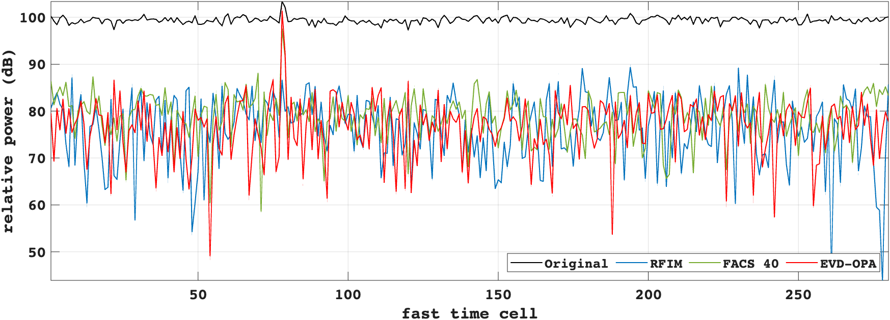

# Adaptive Eigen-Subspace Filtering for Interference Suppression

## Overview
This algorithm uses an adaptive eigen-subspace to estimate the effect of RF interference (RFI) and filter it out of the original signal to retain the signal of interest.

## Result
Compare to other RFI suppression method (FACS, RFIM).

| Method      | SINR (dB)   |
| :---------: | :---------: |
| Original    | 2.597       |
| RFIM        | 10.3382     |
| FACS 40     | 11.1771     |
| EVD         | 20.0399     |