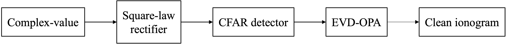
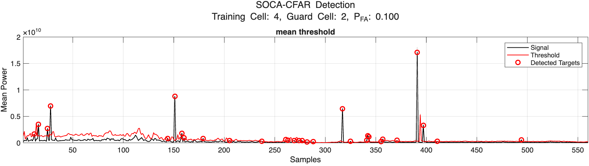

# Adaptive Eigen-Subspace Filtering for Interference Suppression

## Overview
This algorithm uses an adaptive eigen-subspace to estimate the effect of RF interference (RFI) and filter it out of the original signal to retain the signal of interest.

## Flowchart
The flowchart shows the process for removing radio frequency interference. First, convert the complex signal into a power. The signal is then sent to the CFAR detector to detect whether there is any radio frequency interference in the carrier frequency. Once radio frequency interference is detected, EVD-OPA is used to filter out the interference, resulting in a clean ionogram.



## Ionogram
Many carrier frequencies were observed to be shielded by radio frequency interference in the original ionosphere map.


## CFAR Detector
Use a CFAR detector to detect the presence of radio frequency interference. The flowchart is the algorithm of CA-CFAR.

```math
\displaystyle T = \alpha P \\ \alpha=N(P_{FA}^{-\frac{1}{N}}-1) \\ P=\frac{1}{N}\sum^{N}_{n=1}x_{n}
```


### The Variant of CFAR

#### CA-CFAR
The noise level is estimated by averaging the outputs of the reference cells surrounding the cell under test.


#### GOCA-CFAR
The greatest of the two reference window is taken as the noise power estimate.

```math
P=\left \{ \begin{matrix}P_L, & P_L > P_R \\ P_R, & P_R > P_L \end{matrix} \right.
```


#### SOCA-CFAR
The smallest of the sums in the leading and lagging windows is used to estimate the noise power.

```math
P=\left \{ \begin{matrix}P_L, & P_L < P_R \\ P_R, & P_R < P_L \end{matrix} \right.
```



#### OS-CFAR
The samples in the reference window are arranged in ascending order. the <b>kth</b> order statistic represents the noise level.


## Result
The image shows that radio frequency interference has been completely filtered out.


Extract fast time cells with radio frequency interference and signal overlap. Compare to other RFI suppression method (FACS, RFIM). It can be observed that EVD-OPA retains the signal of interest and significantly suppresses radio frequency interference. And the SINR is the highest among all methods of suppressing radio frequency interference.


**SINR**
| Method      | SINR (dB)   |
| :---------: | :---------: |
| Original    | 3.9784      |
| RFIM        | 7.9430      |
| FACS 40     | 17.5532     |
| EVD-OPA     | 23.1041     |